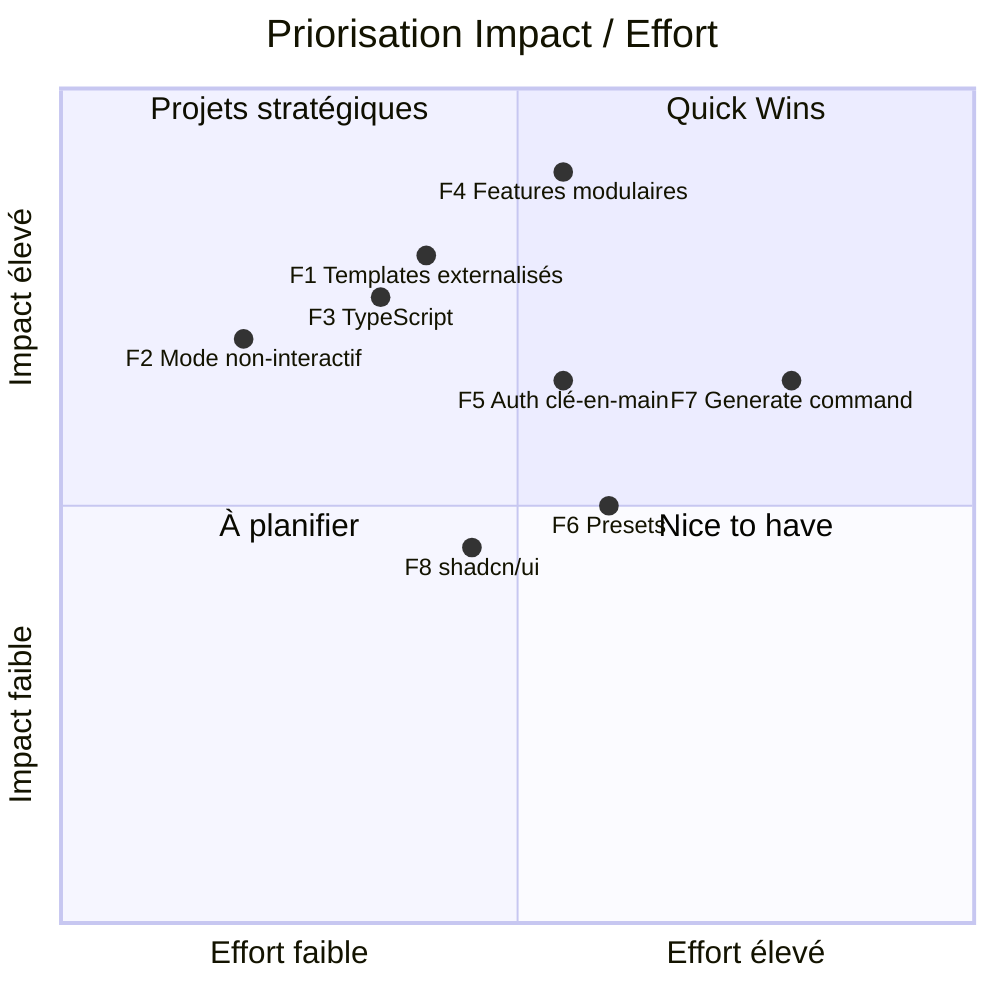

# 🔍 Analyse stratégique — My Stack Generator

## Vue d'ensemble

**My Stack Generator** est un CLI Node.js (`mystack`) qui scaffolde des projets React + Vite + Tailwind CSS v4 avec un backend Firebase ou Supabase. L'ensemble de la logique tient dans un seul fichier de 716 lignes ([index.js](file:///Users/clovis/my-stack-generator/my-stack-generator/index.js)), avec 2 dépendances (`cross-spawn`, `validate-npm-package-name`).

---

## 🚧 Les 3 principales limites actuelles

| # | Limite | Type | Impact | Détail |
|---|--------|------|--------|--------|
| 1 | **Architecture monolithique & dette technique** | 🔧 Technique | **Élevé** | Toute la logique (prompts, validation, templates, I/O fichier, exécution process) vit dans un seul `index.js` de 716 lignes. Les fichiers générés (`.jsx`, `.css`, `.html`, `vite.config.js`) sont hardcodés sous forme de chaînes de caractères massives. Ce fichier est illisible, très difficile à déboguer (pas de coloration syntaxique ni de linting sur ces chaînes) et freine les contributions externes. |
| 2 | **Manque de flexibilité et de robustesse** | 🔧 Technique | **Élevé** | Le template force la création de fichiers en JavaScript brut (`.jsx`). Pour un projet moderne visant la scalabilité, **TypeScript** est devenu la norme industrielle. De plus, les templates inline empêchent toute customisation par l'utilisateur et rendent la mise à jour fastidieuse. |
| 3 | **Aucune extensibilité fonctionnelle ni infrastructure Qualité** | 🎯 Fonctionnel | **Élevé** | Le générateur ne propose que 3 choix (nom, package manager, backend). Aucun système de plugins, pas de features optionnelles (routing, state management, testing, linting…), pas de presets. Le projet généré ne fournit ni configuration ESLint stricte, ni runner de tests (Vitest/Playwright), ni CI prête à l'emploi (GitHub Actions). |

> [!NOTE]
> **Limites secondaires observées** : couverture de tests très faible (17 assertions sur la validation de nom uniquement), absence de CI pour tester la génération complète, pas de mécanisme de mise à jour des projets déjà générés.

---

## 🚀 Features à forte valeur ajoutée

### Axe 1 — Fondations techniques (prérequis)

| # | Feature | Objectif (User Value) | Faisabilité | Fichiers / Composants impactés |
|---|---------|----------------------|-------------|-------------------------------|
| **F1** | **Refonte du système de templates (dossier `/templates` + moteur EJS/Handlebars)** | **Pour le mainteneur :** Modifier les templates avec une vraie coloration syntaxique et ouvrir le projet à l'Open Source. **Pour la communauté :** contribuer sans toucher au code métier. | ✅ **Très haute** — Remplacer les blocs inline par un moteur léger (~50 KB). Les variables contextuelles (`projectName`, `backend`, `pm`) sont déjà extraites. | `index.js` → refonte de la logique d'écriture, **[NEW]** `templates/` directory (fichiers `.hbs`/`.ejs`), **[NEW]** `src/template-engine.js` |
| **F2** | **Mode `--yes` / non-interactif (CI-friendly)** | Permettre la génération automatisée dans un pipeline CI/CD ou un script, sans interaction humaine. Essentiel pour l'adoption en entreprise et les tests E2E. | ✅ **Excellente** — Les valeurs par défaut existent déjà. Il suffit de parser les arguments CLI (avec `commander` ou `minimist`). | `index.js` → ajout parsing d'arguments, **[NEW]** `src/cli.js` (flags `--name`, `--pm`, `--backend`, `--yes`, `--dry-run`) |

---

### Axe 2 — Valeur utilisateur maximale

| # | Feature | Objectif (User Value) | Faisabilité | Fichiers / Composants impactés |
|---|---------|----------------------|-------------|-------------------------------|
| **F3** | **Support de TypeScript** | Apporter la sécurité de typage, une meilleure autocomplétion (DX) et inciter aux bonnes pratiques dès le J0. | ✅ **Haute** — Ajout d'une question CLI, copie des bons templates (`.tsx` au lieu de `.jsx`), injection d'un `tsconfig.json`. | `index.js` (nouvelle question CLI), `templates/ts/` (fichiers TSX, `tsconfig.json`, `vite.config.ts`) |
| **F4** | **Sélection modulaire de features** (React Router, Zustand/Redux, ESLint+Prettier, Vitest…) | Permettre à l'utilisateur de composer son stack sur mesure. Chaque projet est unique, le générateur doit s'adapter. Inclut le routing, le state management, et l'infrastructure qualité. | ✅ **Bonne** — Nécessite que F1 soit fait. Ajout de prompts conditionnels (pattern existant). | `src/prompts.js`, `src/features/` (routeur, state, lint, test), templates associés |
| **F5** | **Composant d'Authentification clé-en-main** | Puisque Firebase/Supabase sont déjà implémentés, fournir une page de login fonctionnelle avec un *Auth Context* connecte frontend et backend immédiatement. | ⚠️ **Moyenne/Haute** — Le SDK est déjà configuré dans `src/lib`. Il reste à générer les hooks d'écoute d'état et un formulaire de login. | `features/auth/AuthContext.tsx` (nouveau), `features/auth/components/LoginForm.tsx`, modification Router/App |

---

### Axe 3 — Écosystème & DX avancée

| # | Feature | Objectif (User Value) | Faisabilité | Fichiers / Composants impactés |
|---|---------|----------------------|-------------|-------------------------------|
| **F6** | **Système de presets sauvegardés** (`.mystackrc`) | Sauvegarder sa configuration préférée et la réutiliser (`mystack --preset enterprise`). Élimine la friction pour les développeurs récurrents. | ⚠️ **Moyenne** — Système de lecture/écriture de config (`cosmiconfig`). Logique de merge config + prompts à penser. | **[NEW]** `src/config.js`, **[NEW]** `~/.mystackrc.json`, `index.js` (merge) |
| **F7** | **Génération de composants post-scaffolding** (`mystack generate component Button`) | Un CLI vivant qui sert aussi pendant le développement. Génère composants, hooks ou features avec la bonne structure. | ⚠️ **Moyenne** — Ajout de sous-commandes (`mystack init` vs `mystack generate`). Pattern bien connu (cf. Angular CLI, Rails). | Refactor en sous-commandes, **[NEW]** `src/commands/init.js`, **[NEW]** `src/commands/generate.js`, **[NEW]** `templates/component.hbs` |
| **F8** | **Boilerplate UI Accessible** (ex: intégration shadcn/ui) | Obtenir des composants pré-stylés et accessibles (RadixUI + Tailwind) pour déployer une interface robuste sans partir de zéro. | ⚠️ **Moyenne** — Injection de `shadcn-ui@latest init` en post-install et configuration de composants de base (Button, Input, Form). | `index.js` (script post-install), **[NEW]** `components.json` |

---

## 📊 Matrice de priorisation

---

## 🎯 Recommandation d'ordre d'implémentation

| Phase | Feature | Justification |
|-------|---------|---------------|
| **Phase 1 — Fondations** | **F2** Mode non-interactif | Quick win, prérequis pour l'automatisation et les tests E2E |
| | **F1** Templates externalisés | Prérequis technique pour F3, F4, F5 et F7 |
| **Phase 2 — Core Value** | **F3** Support TypeScript | Fort impact DX, requiert F1 |
| | **F4** Features modulaires | Apport de valeur maximal pour l'utilisateur |
| **Phase 3 — Écosystème** | **F5** Auth clé-en-main | Connecte frontend/backend, gros différenciateur |
| | **F6** Presets | Complément naturel de F4 |
| **Phase 4 — DX avancée** | **F7** Generate command | Transformation du CLI en outil de développement permanent |
| | **F8** shadcn/ui | Polish final, UI accessible out-of-the-box |
